# Phase 4: CREST - Calibrated Risk Estimation with Source-Aware Temporal Fusion

Phase 4 of the Vehicle Safety Research program. CREST extends the inverse crash-probability foundation of SafeDriver-IQ (Phase 1) and the multi-model risk engine of PRISM (Phase 2) into cooperative freeway hazard prediction. It combines Platt-calibrated hazard probabilities with systematic, per-source ablation of simulated V2V and RSU sensing channels, and supports inference-time behavioral and perception plugins without retraining.

## Authors

Joyjit Roy, Sushanta Das, Samaresh Kumar Singh

## Abstract

Freeway rear-end collisions, often triggered by sudden queue formation, are a leading cause of traffic fatalities. Most hazard-prediction models rely solely on ego-vehicle state or produce uncalibrated risk scores that cannot support actionable alert thresholds, and prior cooperative-sensing work has never isolated the individual contribution of each sensing source. CREST (Calibrated Risk Estimation with Source-Aware Temporal Fusion) combines Platt-calibrated hazard probabilities with systematic per-source ablation across simulated V2V and RSU channels, plus inference-time plugins for behavioral and perception context. The best single cooperative source raises AUPRC from 0.678 (ego-only) to 0.751, while combining all sources drops it to 0.700, indicating indiscriminate fusion diminishes predictive value; a pre-computed behavioral risk score reverses this, reaching 0.808. At a 5% false-alarm rate, CREST delivers a median 2.97 s warning before hazard onset, sufficient for automated braking at highway speeds, and these results hold on an independent freeway dataset with no fine-tuning.

## 1. Introduction

A vehicle at 25 m/s needs over 50 meters to stop under emergency braking, plus 25-30 meters of reaction distance, so a sensor detecting a stopped queue at 60-80 meters has already entered the crash zone. Analytical TTC/stopping-distance methods operate only at that edge and cannot provide meaningful early warning.

SafeDriver-IQ (Phase 1) converts crash classifiers into continuous risk scores from single-vehicle history alone; PRISM (Phase 2) fuses environmental, trajectory, and VRU models via reinforcement learning, but neither accepts V2X input or produces a calibrated probability. Cooperative-perception systems (V2VNet, OPV2V, DiscoNet, Where2comm, CoBEVT, V2X-ViT) fuse multi-agent data for object detection but never isolate each source's individual predictive value. CREST closes these gaps with: (1) the first systematic per-source ablation on real freeway data across ego-only, V2V, three RSU radii, and full fusion; (2) a Platt-calibrated probability giving a 2.97 s median lead time at 5% FAR; (3) an empirical RSU coverage-radius sweep (150/300/500 m -> AUPRC 0.672/0.687/0.722); (4) inference-time plugins, where a behavioral prior lifts AUPRC from 0.678 to 0.808; and (5) cross-continental generalization (US + Italy) with no fine-tuning.

## 2. System Architecture

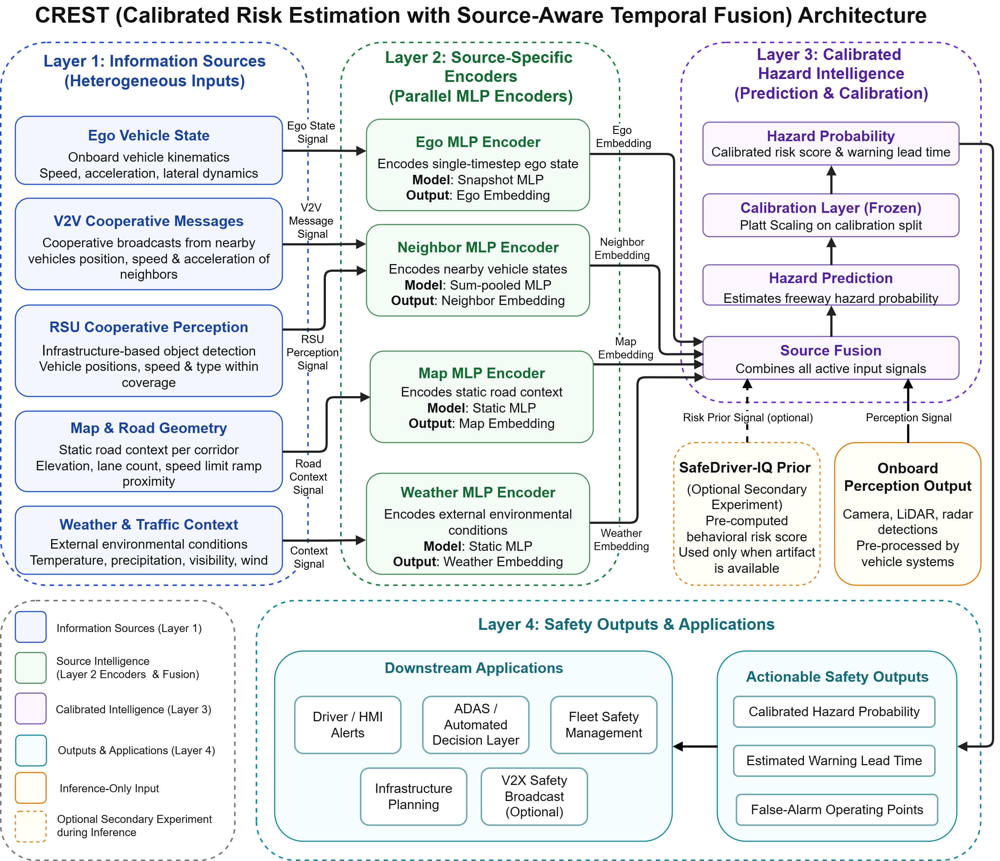

CREST is a four-layer pipeline. **Layer 1** exposes five source blocks per observation window: ego kinematics, V2V messages, RSU perception, static map/road geometry, and dynamic weather/traffic context; any subset can form an input configuration, with inactive sources excluded rather than zero-padded. **Layer 2** encodes each active block through a dedicated MLP: the Ego MLP is a per-timestep snapshot encoder (no temporal recurrence); the Neighbor MLP encodes up to K=10 nearest neighbors within 300 m via sum-pooling regardless of whether they arrive via V2V or RSU; Map and Weather MLPs share an implementation but stay separate ablation arms. The network totals 20,289 parameters. **Layer 3** fuses active encoder outputs through a two-layer MLP to a logit, then a frozen Platt sigmoid (fit on a 1,284-event calibration split, frozen before holdout) yields the calibrated hazard probability. **Layer 4** exposes the probability, lead time, and FAR operating point downstream, plus two inference-time plugins that extend the frozen model without retraining: a **behavioral prior** (pre-computed SafeDriver-IQ score) and an **onboard perception** plugin (camera/LiDAR/radar detections via the Neighbor MLP path).

**V2X Simulation.** No public dataset includes live V2X broadcasts, so V2V/RSU channels are simulated from trajectory replay. V2V Basic Safety Messages follow SAE J2735 (10 Hz, 500 m radius); RSU Collective Perception Messages follow ETSI EN 302 637-2 across a 150/300/500 m coverage sweep.

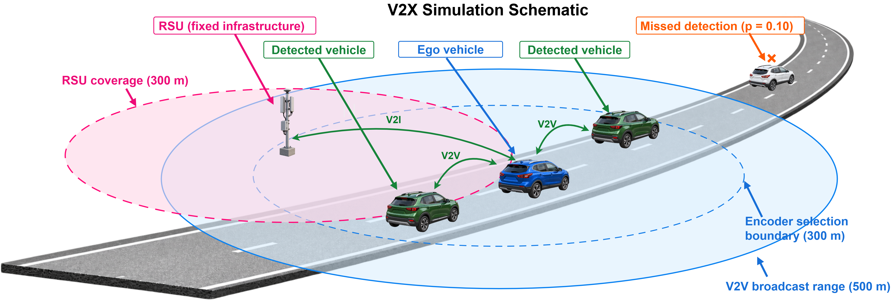

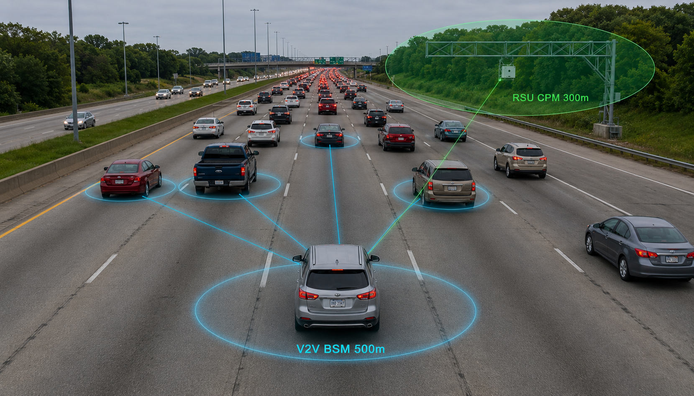

## 3. Datasets

CREST is trained and evaluated on NGSIM and MiTra, two open-access freeway trajectory datasets covering different countries, sensor modalities, and traffic conditions. I-24 MOTION (Nashville, USA) is an independent additional US validation site, evaluated without fine-tuning.

### Dataset Characteristics

| Property | NGSIM | MiTra | I-24 MOTION |
|---|---|---|---|
| Method | Ground camera | Drone | Ground camera |
| Location | California, USA | Milan, Italy | Nashville, USA |
| Freeway | US-101, I-80 | A50 | I-24 |
| Duration | ~45 min/site | 135 min (9 sessions) | 3 incident days (Nov-Dec 2022) |
| Traffic | Mixed | Free-flow to congestion | Incident-driven |
| Labels | Queue onset | Hard braking, queue onset | Queue onset |
| Role | Train + holdout | Train + holdout | US validation |
| Source / Publication | FHWA, ITS DataHub, released 2016 [19] | Chaudhari et al., *Scientific Data*, 2025 [20] | Gloudemans et al., *Transp. Res. Part C*, 2023 [21] |

### Data Split Summary

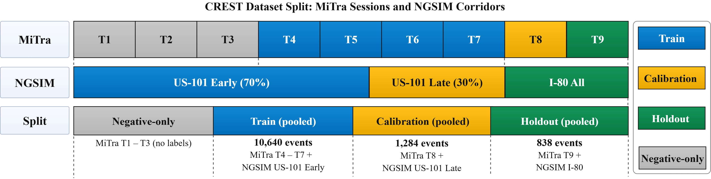

| Split | Source | Events |
|---|---|---|
| Training | MiTra T4-T7 + NGSIM US-101 (first 70%) | 10,640 (5,320 positive + 5,320 negative, balanced) |
| Calibration | MiTra T8 + NGSIM US-101 (last 30%) | 1,284 |
| Holdout | MiTra T9 + NGSIM I-80 | 838 |

### Hazard Label Definitions

| Label Type | Definition | Source |
|---|---|---|
| Hard braking | Deceleration <= -3.9 m/s^2 for at least 0.5 s | MiTra only (NGSIM camera-stitching suppresses extreme deceleration) |
| Queue onset | 3+ adjacent vehicles below 2 m/s for at least 5 s | NGSIM and MiTra |

An observation window is labeled y=1 if either hazard type onset falls within the lookahead horizon T=10 s.

## 4. CREST Input Configurations (Ablation Design)

| ID | Configuration | Active Sources | Family |
|---|---|---|---|
| B0 | TTC Baseline | Analytical only | Baseline |
| B1 | Ego-Only | Ego kinematics | Baseline |
| A1 | Ego + Map Context | Ego + map geometry | Single-source |
| A2 | Ego + Weather | Ego + weather/traffic context | Single-source |
| A3 | Ego + V2V | Ego + V2V BSMs | Single-source |
| A4-150 | Ego + RSU-150 | Ego + RSU (150 m radius) | Infrastructure sweep |
| A4-300 | Ego + RSU-300 | Ego + RSU (300 m radius) | Infrastructure sweep |
| A4-500 | Ego + RSU-500 | Ego + RSU (500 m radius) | Infrastructure sweep |
| F | Full Fusion | All sources | Fusion |
| Fopt | Selective Fusion | Ego + Weather + RSU-500 | Fusion |
| A6 | Ego + Perception Plugin | Ego + onboard perception (inference-time) | Plugin |
| A7 | Ego + Behavioral Prior | Ego + SafeDriver-IQ score (inference-time) | Plugin |

## 5. Results and Discussion

CREST was evaluated across eleven input configurations on the primary holdout (838 events spanning MiTra T9 and NGSIM I-80), summarized below.

| ID | Configuration | AUPRC | Brier | delta pp vs. B1 |
|---|---|---|---|---|
| B0 | TTC Baseline | 0.500 | 0.500 | - |
| B1 | Ego-Only | 0.678 | 0.230 | Ref. |
| A1 | Ego + Map Context | 0.664 | 0.231 | -1.4 |
| A2 | Ego + Weather | **0.751** | 0.218 | **+7.3** |
| A3 | Ego + V2V | 0.674 | 0.230 | -0.4 |
| A4-150 | Ego + RSU-150 | 0.672 | 0.230 | -0.6 |
| A4-300 | Ego + RSU-300 | 0.687 | 0.231 | +0.9 |
| A4-500 | Ego + RSU-500 | 0.722 | 0.229 | +4.4 |
| F | Full Fusion | 0.700 | 0.233 | +2.2 |
| Fopt | Selective Fusion | 0.688 | 0.229 | +1.0 |
| A6 | Ego + Perception Plugin† | 0.694 | 0.226 | +1.6 |
| A7 | Ego + Behavioral Prior† | **0.808** | **0.166** | **+13.0** |

†Inference-time plugins; base model not retrained.

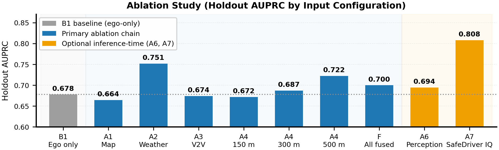

**Source Attribution.** Cooperative sources contribute unequal, non-additive value. Weather/traffic (A2) is the strongest single source (0.751, +7.3 pp), showing dynamic environmental state carries real signal; static map geometry (A1) slightly degrades performance, adding noise rather than signal. RSU coverage improves monotonically with radius (0.672 -> 0.687 -> 0.722 at 150/300/500 m), while V2V (A3) provides only a marginal +0.4 pp lift under simulated channel conditions.

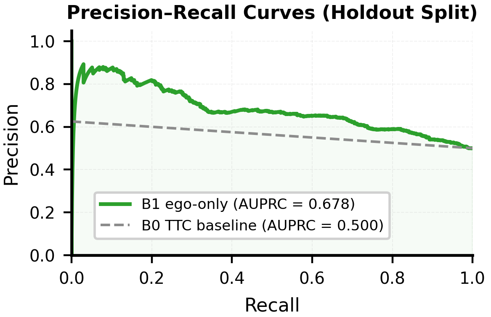

B1 (ego-only) exceeds B0 (the non-learned TTC baseline) by 17.8 pp AUPRC, confirming learned temporal modeling adds substantial value even without cooperative input.

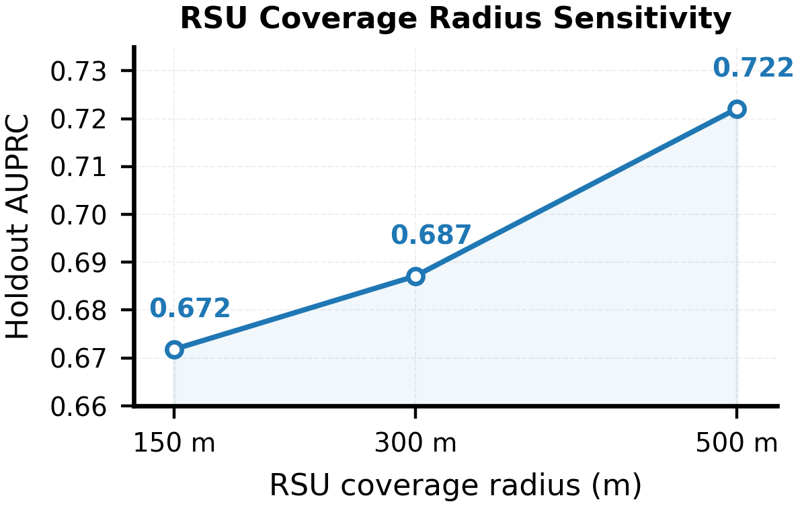

**Negative Transfer.** Full Fusion (0.700) and Selective Fusion (Fopt, 0.688, weather + RSU-500 only) both underperform their best single-source components (0.751, 0.722): the MLP fusion head fails to suppress cross-source interference within the current training budget. Source selection and weighting, not indiscriminate combination, is the more effective design strategy.

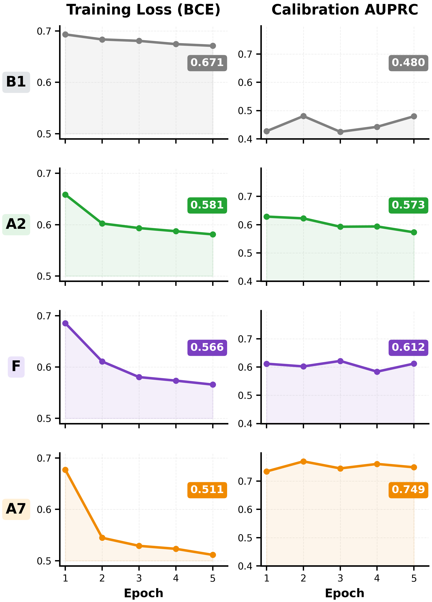

B1 and A2 converge within 3 epochs with no overfitting on the calibration split.

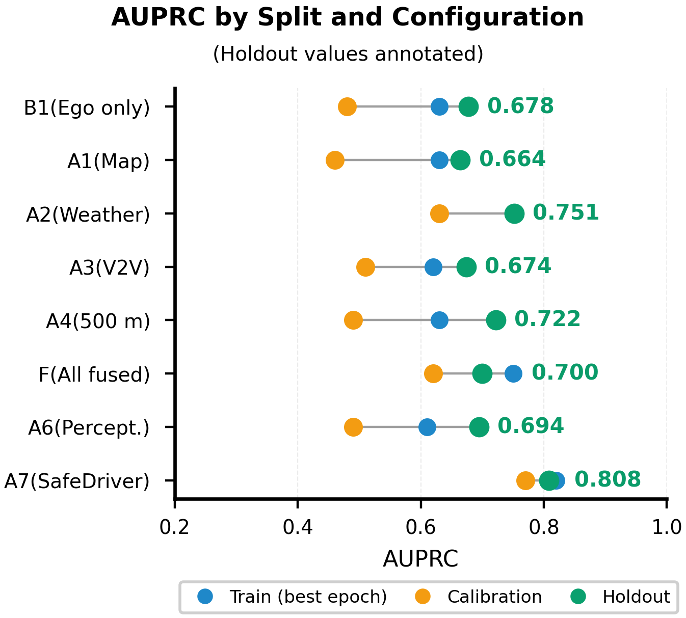

**Cross-Site Generalization.** CREST (B1) on I-24 MOTION reaches 0.666 AUPRC, only 1.2 pp below the primary holdout, confirming stable generalization. Retraining Fopt there raises it to 0.688, still below the best single source, so negative transfer is a property of the fusion mechanism itself, not one training distribution.

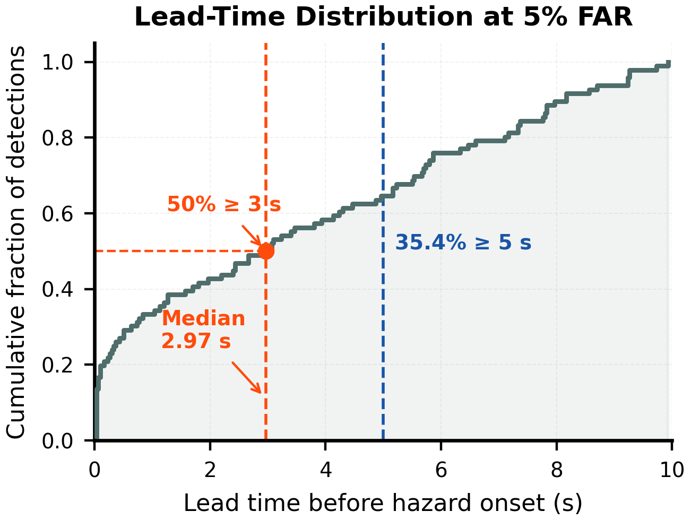

**Lead Time.** At 5% FAR, CREST detects 96/838 events (11.5%), median 2.97 s / mean 3.52 s; about half of detections give at least 3 s warning. At 1% FAR detection drops to 2.5% (median 1.27 s); at 10% FAR it rises to 23.6% but median lead time falls to 2.37 s. The 5% point was fixed before evaluation.

**Calibration and Plugins.** Platt parameters are fit on the calibration split and frozen before holdout, so calibration is a training-pipeline constraint, not a post-hoc fix, making the lead-time/FAR operating points above operationally meaningful. The behavioral prior plugin (A7) reaches the best overall result, 0.808 AUPRC (+13.0 pp), from a strong SafeDriver-IQ score separation between hazard and non-hazard events; the perception plugin (A6) adds a more modest +1.6 pp. Both operate purely at inference time, letting fleets add signal sources post-deployment without retraining or recertifying the base model.

## 6. Real-Time Inference and Deployment

At each time step, CREST validates timestamp alignment and source freshness, then builds the scene from information available up to that point only (causal ordering). Each active source runs through its independent encoder, so the frozen model works on any subset and continues on remaining sources if a channel drops (not evaluated live). Algorithm 1 gives the per-timestep procedure.

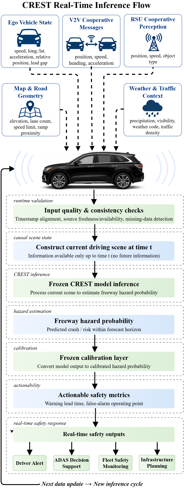

```
Algorithm 1 - CREST Real-Time Hazard Inference
Require: Ego state x_ego in R^6; V2X message set M; map/weather context c in R^8;
         frozen Platt parameters (a, b); FAR threshold tau
Ensure:  Calibrated hazard probability p; alert decision d

1: N   <- { m in M : ||m.pos - x_ego.pos||_2 <= 300 }        # neighbors within 300 m
2: N_K <- TopK(N, k=10, key=distance)                        # top-10 nearest neighbors
3: e   <- f_ego(x_ego)                                       # ego encoder, e in R^64
4: v   <- mean_{j in N_K} f_nbr(x_j)                          # neighbor encoder, mean-pooled
5: m   <- f_map(c)                                            # map/weather encoder
6: l   <- f_fuse([e; v; m])                                   # fusion MLP, raw logit
7: p   <- sigmoid(a * l + b)                                  # frozen Platt calibration
8: if p > tau then d <- 1 else d <- 0                         # alert decision
9: return p, d
```

The alert operating point is fixed at 5% FAR, set before evaluation and never adjusted afterward. On CPU, a forward pass runs in 61.7 microseconds, well inside the 100 ms V2X broadcast cycle.

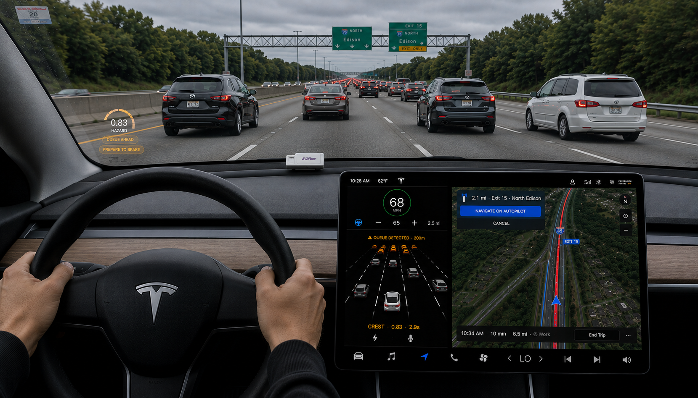

Illustrative HMI display: hazard probability 0.83, lead time 2.9 s, queue-ahead advisory (indicative only; interface design is outside this paper's scope).

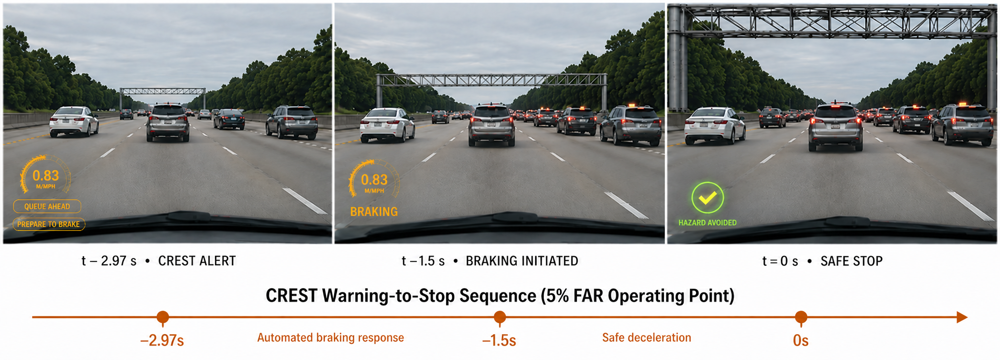

Warning-to-stop sequence at the median lead time: alert at t = -2.97 s, braking at t = -1.5 s, safe stop at t = 0 s, giving a 1.47 s driver/ADAS response window.

Full cooperative deployment depends on roadside V2X infrastructure and vehicle-side OBUs, neither evaluated here; latency budgets, congestion reliability, certification, and fleet penetration remain open questions.

## 7. Application Examples

The calibrated probability and lead time plug directly into graduated alert systems: **ADAS** can threshold at 5% FAR for a known false-alarm rate and ~3 s warning window; **fleet monitoring** can aggregate the probability stream across trips to flag high-hazard corridors without requiring an actual crash; **infrastructure planning** can use the RSU coverage-radius sweep (0.672/0.687/0.722 at 150/300/500 m) to size roadside sensor deployment density.

## 8. Repository Structure

```
phase4-crest/
├── configs/                        # Frozen experiment configuration (YAML)
│   ├── base.yaml                   # Label thresholds, horizon, splits, V2X sim params
│   ├── model.yaml                  # CREST architecture (encoder dims, fusion, dropout)
│   └── splits.yaml                 # Train/calibration/holdout assignment
├── docs/
│   └── images/                     # Paper figures (F1-F15)
├── src/crest/                      # Main Python package
│   ├── adapters/
│   │   ├── schema.py                # Canonical trajectory schema + validation
│   │   ├── ngsim.py                 # NGSIM CSV -> canonical schema adapter
│   │   └── mitra.py                 # MiTra CSV -> canonical schema adapter
│   ├── labels/
│   │   └── event_extraction.py      # Hard-braking + queue-onset label extraction
│   ├── features/
│   │   ├── snapshot.py              # Per-timestep feature snapshot extraction
│   │   ├── map_features.py          # Synthetic map/elevation feature generator (A1)
│   │   └── v2x_sim.py                # V2V/RSU simulation + detection uncertainty (A3/A4)
│   ├── datasets/
│   │   └── crest_dataset.py         # PyTorch Dataset over canonical trajectory data
│   ├── models/
│   │   ├── architecture.py          # CRESTConfig + CRESTModel (ego/neighbor/map encoders, fusion)
│   │   └── neighbor_utils.py        # Top-K neighbor selection utilities
│   └── evaluation/                  # Metrics, calibration, statistical tests
└── scripts/                         # Runnable pipeline scripts (see table below)
```

### Scripts Reference

| Script | Purpose |
|---|---|
| `run_ngsim_p0_audit.py` | P0 audit: independent hard-braking / queue-onset event counts on NGSIM |
| `run_ngsim_hard_brake_quick.py` | Quick NGSIM hard-braking sanity check |
| `verify_canonical_schema.py` | Verifies canonical schema on sample NGSIM/MiTra rows |
| `verify_coordinate_conversions.py` | Verifies unit conversions (NGSIM ft->m; MiTra km/h->m/s) |
| `verify_safedriver_iq_prior.py` | Verifies SafeDriver-IQ prior artifact loadability (A7) |
| `label_threshold_sensitivity.py` | Hard-braking threshold sensitivity sweep (-3.0/-3.5/-3.9/-4.5 m/s^2) |
| `label_horizon_sensitivity.py` | Prediction-horizon sensitivity sweep (5/10/15/20 s) |
| `build_labels.py` | Extracts hazard event windows and labels from canonical trajectories |
| `assign_splits.py` | Assigns train/calibration/holdout splits per `configs/splits.yaml` |
| `designate_calibration_split.py` | Reserves the calibration split for Platt scaling |
| `precompute_features.py` | Precomputes B1 (ego-only) feature tensors to NPZ |
| `precompute_features_a1.py` | Precomputes A1 features (ego + synthetic map/elevation) |
| `precompute_features_a2.py` | Precomputes A2 features (ego + weather/traffic context) |
| `precompute_features_a3.py` | Precomputes A3 features (ego + simulated V2V BSMs) |
| `precompute_features_a4.py` | Precomputes A4 features (ego + simulated RSU CPMs, radius sweep) |
| `precompute_features_a6.py` | Precomputes A6 features (ego + onboard perception plugin) |
| `precompute_features_a7.py` | Precomputes A7 features (ego + SafeDriver-IQ behavioral prior plugin) |
| `precompute_features_f.py` | Precomputes F features (all channels combined) |
| `precompute_features_f2.py` / `_f3.py` | Alternate full-fusion feature variants |
| `precompute_features_fopt.py` | Precomputes Fopt features (ego + weather + RSU-500) |
| `fetch_weather.py` | Fetches historical hourly weather (Open-Meteo) for NGSIM/MiTra sessions |
| `fetch_elevation.py` | Fetches elevation + OSM road features for map/elevation channel |
| `extract_i24_windows.py` | Extracts I-24 MOTION observation windows for independent validation |
| `compute_b0_baseline.py` | Computes the analytical TTC/stopping-distance B0 baseline |
| `train_baseline.py` | Trains the B1 ego-only CREST model |
| `train_fopt.py` | Trains the Fopt selective-fusion model |
| `run_ablations.py` | Trains/evaluates all ablation configurations (A1-A4, F, A6, A7) |
| `eval_holdout.py` | Evaluates a trained checkpoint on the holdout split |
| `infer_i24_holdout.py` | Runs inference on the I-24 MOTION holdout without fine-tuning |
| `compute_lead_time.py` | Computes lead time at FAR operating points (1%, 5%, 10%) |
| `generate_figures.py` | Generates all publication figures from saved results JSON/NPZ |

### Configuration Files

| File | Contents |
|---|---|
| `configs/base.yaml` | Prediction horizon (T=10s), label thresholds, sampling rate, V2X simulation params (RSU coverage radii, detection uncertainty) |
| `configs/model.yaml` | CREST architecture: input features, ego/neighbor/map encoder dims, fusion MLP, dropout |
| `configs/splits.yaml` | Train/calibration/holdout split assignment (session/time-based) |

## 9. Pre-Model-Code Checkpoints

Before the first model file was written, the following were completed and confirmed:

1. NGSIM P0 audit: independent hard-braking and queue-onset event counts.
2. MiTra session usage confirmed and teleporting-jump vehicle IDs excluded.
3. Canonical schema implemented and verified on sample rows from NGSIM and MiTra.
4. Prediction-horizon T sensitivity (5s, 10s, 15s, 20s) and freeze T = 10s.
5. Hard-braking threshold sensitivity (-3.0, -3.5, -3.9, -4.5 m/s^2) and freeze -3.9.
6. Coordinate conversions verified (NGSIM feet -> m; MiTra km/h -> m/s).
7. RSU coverage-radius and detection-uncertainty parameters configured.
8. Calibration split reserved: last 20% of NGSIM US-101 + last 20% of MiTra T6 by time.
9. SafeDriver-IQ prior artifact loadability verified (optional A5/A7).
10. Framework: PyTorch; V2V encoder as sum-pooled MLP over top-K neighbors.

All label thresholds and evaluation protocols are frozen in `configs/base.yaml`.

## 10. Quick Commands

```bash
# 1. Audit and verification
python scripts/run_ngsim_p0_audit.py
python scripts/verify_canonical_schema.py
python scripts/verify_coordinate_conversions.py

# 2. Labels and splits
python scripts/build_labels.py
python scripts/assign_splits.py

# 3. Precompute features per configuration
python scripts/precompute_features.py        # B1
python scripts/precompute_features_a1.py      # A1
python scripts/precompute_features_a2.py      # A2
python scripts/precompute_features_a3.py      # A3
python scripts/precompute_features_a4.py      # A4 (150/300/500)
python scripts/precompute_features_f.py       # F
python scripts/precompute_features_fopt.py    # Fopt
python scripts/precompute_features_a6.py      # A6
python scripts/precompute_features_a7.py      # A7

# 4. Baselines and training
python scripts/compute_b0_baseline.py
python scripts/train_baseline.py              # B1
python scripts/run_ablations.py               # A1-A4, F, A6, A7
python scripts/train_fopt.py                  # Fopt

# 5. Evaluation
python scripts/eval_holdout.py
python scripts/infer_i24_holdout.py
python scripts/compute_lead_time.py

# 6. Figures
python scripts/generate_figures.py
```

## 11. Limitations

- **Simulated V2X.** V2V/RSU channels are simulated from trajectory replay, not live broadcasts; packet loss, latency, and interference are only parametrically modeled, so live-channel performance may differ.
- **Snapshot Encoding.** Encoders process each window independently with no temporal recurrence; recurrent/attention-based encoding may capture additional predictive structure.
- **Detection Rate.** At 5% FAR, only 96/838 holdout events (11.5%) are detected; most hazard events are missed at this conservative operating point.
- **Geographic Scope.** Evaluation covers only US/European freeways (NGSIM, MiTra, I-24 MOTION); urban arterials and signalized intersections are untested.
- **Simulated Behavioral Prior.** The A7 plugin's SafeDriver-IQ score is computed from the same trajectory data used for training/evaluation, so 0.808 AUPRC should be treated as an upper bound, not a guaranteed field result.

## 12. Conclusion and Future Directions

CREST establishes source-aware ablation as a design principle for cooperative freeway hazard prediction, pairing per-source attribution with Platt-calibrated probabilities to support evidence-based infrastructure decisions. Cooperative sources prove non-additive: the best single source (A2, 0.751) beats full fusion (0.700), while a behavioral prior at inference (A7) gives the strongest result overall (0.808 AUPRC, 0.166 Brier). The model generalizes to an independent Tennessee dataset with zero fine-tuning, delivers a 2.97 s median warning at 5% FAR, and runs in 61.7 microseconds on CPU, well inside the 100 ms V2X broadcast cycle.

CREST is designed as a deployable upstream module that can integrate with graduated alert architectures such as PRISM without per-site recalibration, and its RSU coverage-sensitivity results give infrastructure planners empirical deployment-density guidance. Future work: validate on live V2X field data, assess real-time behavioral score streams on connected-vehicle testbeds, resolve the fusion head's negative-transfer pattern, and jointly train the inference-time plugins with the base model.

## 13. Publication Status

Not yet submitted or published. Citation details will be added once available.
